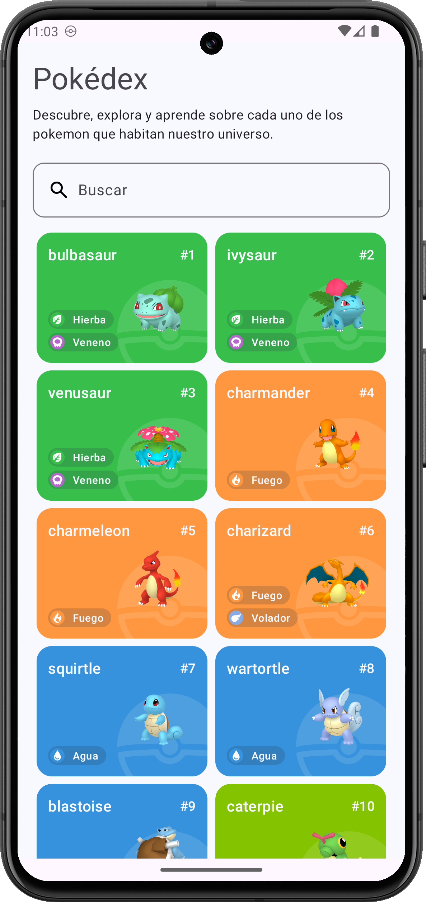
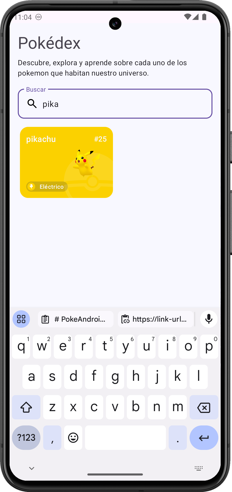
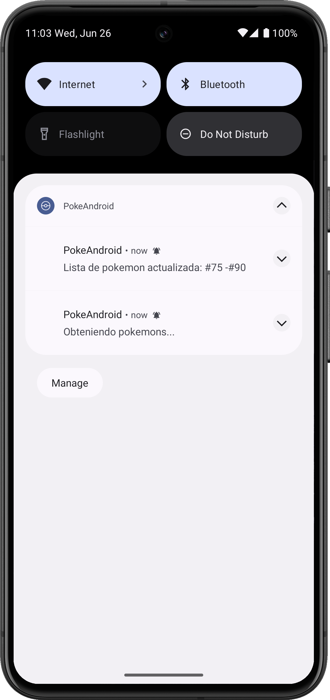

# PokeAndroidApp

Una aplicación de Pokédex que muestra una lista de Pokémon, sus detalles, tipos y más. Esta aplicación está construida utilizando Kotlin, Retrofit para las peticiones de red, Room para el almacenamiento local, coroutines para la concurrencia e inyeccion de dependencias.


## Caracteristicas

- Obtener pokemons desde internet haciendo uso de la [PokeApi](https://link-url-here.org)
- Mostrar pokemones almacenados en la base de datos local del dispositivo
- Detalles de cada Pokémon, incluyendo nombre, imagen, tipos con sus colores.
- Actualización automática de la lista de Pokémon cada 30 segundos mediante un servicio en segundo plano.
- Notificaciones que informan al usuario cuando la lista de Pokémon ha sido actualizada.
- Búsqueda en la lista de Pokémon por nombre y tipo.
- Manejo de errores y estados de carga mediante StateFlow.


## Instalación


Prerequisito tener instalado [Android Studio](https://developer.android.com/studio) en su version mas reciente.

- Clonar repositorio

```bash
  git clone https://github.com/massana2110/PokeAndroidApp.git
```

- Abrir el proyecto en Android Studio
- Sincroniza el proyecto con Gradle para descargar todas las dependencias necesarias.

## Arquitectura del proyecto

La aplicación sigue la arquitectura MVVM (Model-View-ViewModel) junto con principios de Clean Architecture y uso de inyección de dependencias para separar las responsabilidades y facilitar el mantenimiento y la prueba del código.

- **Data Layer**: Maneja las operaciones de red y almacenamiento local, en ella se encuentran los siguientes componentes:
    - datasources: Carpeta que contiene las definiciones de la conexion a API (PokeAndroidClient) y a base de datos(PokeAndroidDatabase).
    - mappers: Contiene las definiciones de mapeadores de objetos de domain layer a data layer.
    - repositories: Contiene los repositorios de datos el cual hace el puente a los diferentes datasources que consume la app

- **Domain Layer**: Contiene la lógica de negocio como Use Cases: Casos de uso que encapsulan operaciones específicas (ej. guardar Pokémon en la base de datos, obtener la lista de Pokémon), modelos de dominio que consumira la UI.

- **Presentation Layer**: Maneja la UI y la interacción del usuario.
    - ViewModel: Gestiona los datos y estados para las vistas.
    - Activity/Fragment: Componentes de la UI que observan los estados del ViewModel y actualizan la interfaz de usuario.
    - Adapter: Definiciones de RecyclerView Adapters que actualizan los listados de datos a presentar en la UI

## Screenshots

<table>
  <thead>
    <tr>
      <th>Pantalla principal</th>
      <th>Pantalla de busqueda</th>
      <th>Notificaciones</th>
    </tr>
  </thead>
  <tbody>
    <tr>
      <td>
        
      </td>
      <td>
        
      </td>
      <td>
        
      </td>
    </tr>
  </tbody>
</table>

## Authors

- David Massana (Android Developer): [massana2110](https://github.com/massana2110)

